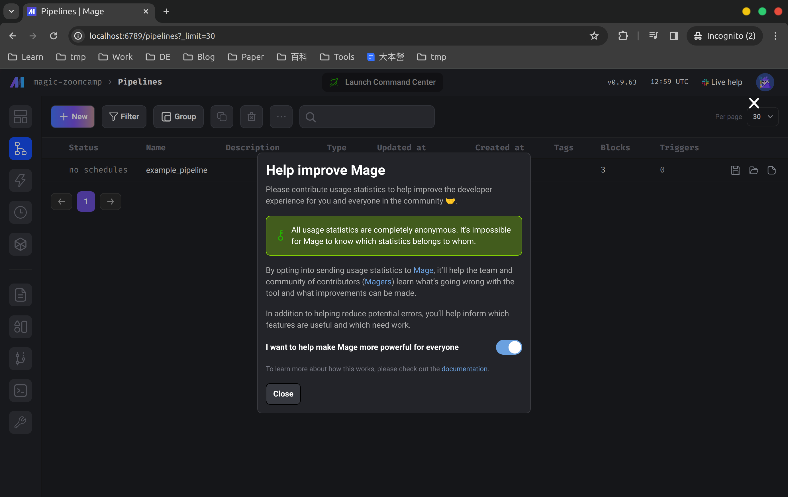
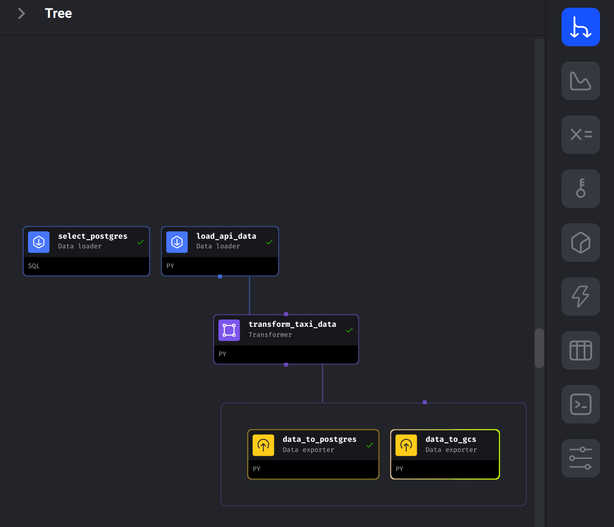

# Mage
workflow orchestration with Mage

## Steps

### Setup empty mage project

1. download from [mage-ai/mage-zoomcamp](https://github.com/mage-ai/mage-zoomcamp).
```sh
git clone https://github.com/mage-ai/mage-zoomcamp.git mage-project
```

2. remove .git folder because I have my git versioning outside folder.
```
rm -rf .git
```
and then remove `magic-zoomcamp` in `.gitignore` for git versioning control.

3. create `.env` from `dev.env`
```sh
cp dev.env .env
```

4. run
```sh
cd mage-project
docker compose build
docker compose up
```
navigate to http://localhost:6789, you can see...


- "Help improve Mage": ask you permission to contribute usage statistics to help improve the developer.
- "example_pipeline": default example.

and it initialized a new mage repository. It will be present in your project under the name `magic-zoomcamp`. If you changed the varable `PROJECT_NAME` in the `.env` file, it will be named whatever you set it to.
This repository should have the following structure:
```
.
├── mage_data
│   └── magic-zoomcamp
├── magic-zoomcamp
│   ├── __pycache__
│   ├── charts
│   ├── custom
│   ├── data_exporters
│   ├── data_loaders
│   ├── dbt
│   ├── extensions
│   ├── interactions
│   ├── pipelines
│   ├── scratchpads
│   ├── transformers
│   ├── utils
│   ├── __init__.py
│   ├── io_config.yaml
│   ├── metadata.yaml
│   └── requirements.txt
├── Dockerfile
├── README.md
├── dev.env
├── .env
├── docker-compose.yml
└── requirements.txt
```

If you not use postgres-related part in `docker-compose.yml`, such as [mage-ai/compose-quickstart](https://github.com/mage-ai/compose-quickstart), I think you can remove it. but I haven't try it.

### Build a pipeline for ny_taxi

#### Prerequisites
before start, something need to do...

- if use postgres, update your postgres info and create `dev` environment

add dev environment to `io_config.yaml` using postgres in docker-compose.
```yaml
dev:
  # PostgresSQL
  POSTGRES_CONNECT_TIMEOUT: 10
  POSTGRES_DBNAME: "{{ env_var('POSTGRES_DBNAME') }}"
  POSTGRES_SCHEMA: "{{ env_var('POSTGRES_SCHEMA') }}"
  POSTGRES_USER: "{{ env_var('POSTGRES_USER') }}"
  POSTGRES_PASSWORD: "{{ env_var('POSTGRES_PASSWORD') }}"
  POSTGRES_HOST: "{{ env_var('POSTGRES_HOST') }}"
  POSTGRES_PORT: "{{ env_var('POSTGRES_PORT') }}"
```

- if use gcp, add google crediential json

update the line 23 `~/Documents/secrets/personal-gcp.json:/home/src/personal-gcp.json` in `docker-compose.yml` to fit the path of your google crediential json file.

update Google part in `io_config.yaml` to be like below
```yaml
# Google
GOOGLE_SERVICE_ACC_KEY_FILEPATH: "/home/src/personal-gcp.json"  # replace filename depond on your settings in docker-compose.yml
GOOGLE_LOCATION: US # Optional
```

update `.env`
```
GOOGLE_APPLICATION_CREDENTIALS=/home/src/personal_gcp.json  # replace filename
```

restart docker compose
```sh
docker compose stop
docker compose rm

docker compose build  # becuase changing the docker-compose.yml
docker compose up
```

- (optional) if any packages need to install, you can add into `requirements.txt`

#### Build
steps according to the homework.

run `docker compose up` and navigate to `http://localhost:6789`.

1. Create new "Pipeline"

2. Add `Data loader` 

choose `Python` > `API`, update to [file](./mage-project/magic-zoomcamp/data_loaders/load_api_data.py).

3. Add `Transformer` 

choose `Python` > `Generic (no template)`, update to [file](./mage-project/magic-zoomcamp/transformers/transform_taxi_data.py).

4. Add `Data exporter`

4-1. Postgres (development, locally)

choose `Python` > `PostgreSQL`, update to [file](./mage-project/magic-zoomcamp/data_exporters/data_to_postgres.py).

use "Data Loader" to check, choose `SQL`, the options: 
- Connection: `PostgreSQL`
- Profile: `dev`
- Use raw SQL 

and update to [file](./mage-project/magic-zoomcamp/data_loaders/select_postgres.sql).


4-2 GCS

4-2-1 GCP Services Up

```sh
cd ../../week_1_basics_n_setup/1_terraform_gcp/terraform
terraform apply
```

4-2-2 Add project environment variable

update `.env`
```
PROJECT_ID=xxxxx  # replace
BUCKET_NAME=xxxxx  # replace 
TABLE_NAME=nyc_taxi_data
```

restart docker compose
```sh
docker compose stop
docker compose rm

docker compose build  # becuase changing the docker-compose.yml
docker compose up
```

4-2-3 Add `Data exporter`

choose `Python` > `Generic (no template)`, update to [file](./mage-project/magic-zoomcamp/data_exporters/data_to_gcs.py).

4-2-4 Check "Tree"

all exporters is under the transformer, like below.



About source code
go back to vscode, you can see ...
```
.
├── mage_data
│   └── magic-zoomcamp
├── magic-zoomcamp
│   ├── __pycache__
│   ├── charts
│   ├── custom
│   ├── data_exporters   // data_exporters
│   ├── data_loaders     // data_loaders
│   ├── dbt
│   ├── extensions
│   ├── interactions
│   ├── pipelines        // pipelines
│   ├── scratchpads
│   ├── transformers     // transformers
│   ├── utils
│   ├── __init__.py
│   ├── io_config.yaml
│   ├── metadata.yaml
│   └── requirements.txt
├── Dockerfile
├── README.md
├── dev.env
├── .env                 // project environment variables (project name, postgres...)
├── docker-compose.yml
└── requirements.txt
```
more details about project structure, you can see [officical website](https://docs.mage.ai/design/abstractions/project-structure).


## Reference
- [Mage Zoomcamp](https://github.com/DataTalksClub/data-engineering-zoomcamp/tree/main/02-workflow-orchestration)
